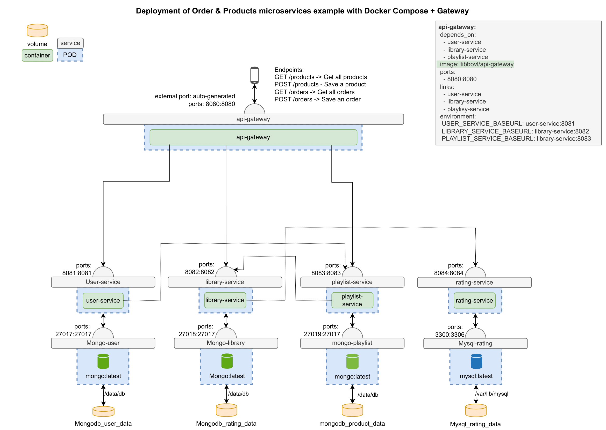

# EDE Project Documentation

Welcome to the documentation for my Enterprise Development Experience repository. This document provides an overview of the project's services, endpoints, and their connections.

## Project theme

My EDE project centers around a music service, featuring functionalities such as playlist management, song (and podcast)[^1] library maintenance, user registration, and ratings for songs (and podcast episodes)[^1]. The project's documentation illustrates the structure of the services, including their endpoints and operations.

[^1]: Expansion.
## Services structure

### Gateway

Serving as a link between various services, the gateway streamlines the user experience by converting specific service URLs to a unified format, reducing the complexity associated with managing multiple ports. It also plays a crucial role in enforcing a robust authentication system, ensuring secure access to the services, with the exception of specific exempted endpoints that are publicly accessible. 
Examples of URL conversions:

- `http://localhost:8081/api/user/{id}` -> `http://localhost:8080/user/{id}`
- `http://localhost:8082/api/song/{songId}` -> `http://localhost:8080/library/song/{songId}`
- `http://localhost:8083/api/playlist/{playlistId}` -> `http://localhost:8080/playlist/{playlistId}`
- `http://localhost:8084/api/rating/{itemId}` -> `http://localhost:8080/rating/{itemId}`

This centralized approach not only simplifies user interaction but also ensures that data security is maintained, guaranteeing that only authorized users can access the services.

### User service

This service manages user-related operations, such as user registration, updating user information, and account deletion.

| Mapping | Endpoints        | Comments                     | Requires Auth |
| ------- | ---------------- | ---------------------------- | ------------- |
| POST    | `/user`          | Create a new user.           | No            |
| GET     | `/user/{userId}` | Retrieve user details by ID. | No            |
| PUT     | `/user/{userId}` | Update user information.     | No            |
| DELETE  | `/user/{userId}` | Delete a user account.       | No            |

### Library service

The Library Service is responsible for managing music and podcast content, including adding, updating, and deleting songs and podcast episodes.

| Mapping | Endpoints                       | Comments                                   | Requires Auth |
| --------- | ------------------------------- | ------------------------------------------ | ------------------- |
| POST      | `/song`                 | Add a new song to the library.             | Yes |
| GET       | `/song/{songId}`        | Retrieve song details by ID.               | No |
| PUT       | `/song/{songId}`        | Update song information.                   | Yes |
| DELETE    | `/song/{songId}`        | Delete a song from the library.            | Yes |
<!---| POST      | `/library/podcasts`             | Add a new podcast episode to the library.  | Yes |
| GET       | `/library/podcasts/{podcastId}` | Retrieve podcast episode details by ID.    | Yes |
| PUT       | `/library/podcasts/{podcastId}` | Update podcast episode information.        | Yes |
| DELETE    | `/library/podcasts/{podcastId}` | Delete a podcast episode from the library. | Yes |-->

### Playlist service

This service manages user playlists, allowing users to create, update, and delete playlists, and add or remove songs from playlists.

| Mapping | Endpoints                         | Comments                   | Requires Auth |
| --------- | --------------------------------- | -------------------------- | ------------------- |
| POST      | `/playlist`                       | Create a new playlist.     | Yes |
| GET       | `/playlist/{playlistId}`          | Get a playlist.            | No |
| GET       | `/playlist/user/{userId}`         | Get a user's playlists.    | Yes |
| PUT       | `/playlist/{playlistId}`          | Update playlist info.      | Yes |
| PUT       | `/playlist/{playlistId}/{songId}` | Add a song to playlist.    | Yes |
| DELETE    | `/playlist/{playlistId}/{songId}` | Remove song from playlist. | Yes |
| DELETE    | `/playlist/{playlistId}`          | Delete playlist.           | Yes |

### Rating service

This service manages user ratings for songs and podcast episodes.

| Mapping | Endpoints          | Comments                              | Requires Auth |
| ------- | ------------------ | ------------------------------------- | ------------- |
| POST    | - `/rating`        | Rate a song or podcast episode.       | Yes            |
| GET     | - `/rating/{itemId}` | Retrieve ratings for a specific item. | Yes            |
| PUT     | - `/rating/{itemId}` | Update a rating for an item.          | Yes            |
| DELETE  | - `/rating/{itemId}` | Delete a rating for an item.          | Yes            |

## My expansions
> test
