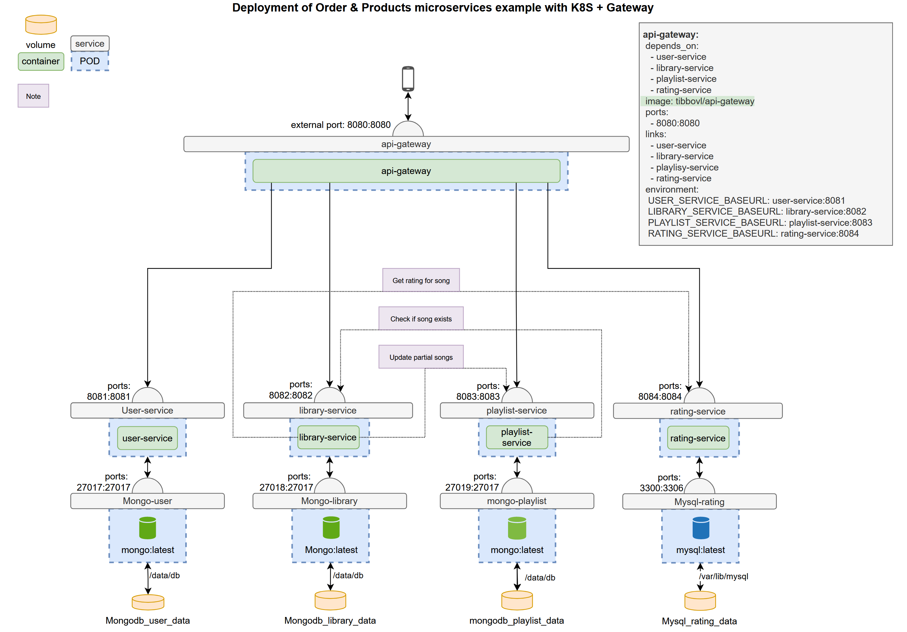

# EDE Project Documentation

Welcome to the documentation for my Enterprise Development Experience repository. This document provides an overview of the project's services, endpoints, and their connections.

## Project theme

My EDE project centers around a music service, featuring functionalities such as playlist management, song (and podcast)[^1] library maintenance, user registration, and ratings for songs (and podcast episodes)[^1]. The project's documentation illustrates the structure of the services, including their endpoints and operations.

[^1]: Expansion.
## Services structure

### Gateway

### User service

This service manages user-related operations, such as user registration, updating user information, and account deletion.

| Call Type | Endpoints        | Comments                     |
| --------- | ---------------- | ---------------------------- |
| POST      | - /user          | Create a new user.           |
| GET       | - /user/{userId} | Retrieve user details by ID. |
| PUT       | - /user/{userId} | Update user information.     |
| DELETE    | - /user/{userId} | Delete a user account.       |

### Library service

The Library Service is responsible for managing music and podcast content, including adding, updating, and deleting songs and podcast episodes.

| Call Type | Endpoints                       | Comments                                   | Access without auth |
| --------- | ------------------------------- | ------------------------------------------ | ------------------- |
| POST      | `/library/song`                 | Add a new song to the library.             | No |
| GET       | `/library/song/{songId}`        | Retrieve song details by ID.               | Yes |
| PUT       | `/library/song/{songId}`        | Update song information.                   | No |
| DELETE    | `/library/song/{songId}`        | Delete a song from the library.            | No |
| POST      | `/library/podcasts`             | Add a new podcast episode to the library.  | No |
| GET       | `/library/podcasts/{podcastId}` | Retrieve podcast episode details by ID.    | No |
| PUT       | `/library/podcasts/{podcastId}` | Update podcast episode information.        | No |
| DELETE    | `/library/podcasts/{podcastId}` | Delete a podcast episode from the library. | No |

### Playlist service

This service manages user playlists, allowing users to create, update, and delete playlists, and add or remove songs from playlists.

| Call Type | Endpoints                         | Comments                   | Access without auth |
| --------- | --------------------------------- | -------------------------- | ------------------- |
| POST      | `/playlist`                       | Create a new playlist.     | No |
| GET       | `/playlist/{playlistId}`          | Get a playlist.            | Yes |
| GET       | `/playlist/user/{userId}`         | Get a user's playlists.    | No |
| PUT       | `/playlist/{playlistId}`          | Update playlist info.      | No |
| PUT       | `/playlist/{playlistId}/{songId}` | Add a song to playlist.    | No |
| DELETE    | `/playlist/{playlistId}/{songId}` | Remove song from playlist. | No |
| DELETE    | `/playlist/{playlistId}`          | Delete playlist.           | No |

### Rating service

This service manages user ratings for songs and podcast episodes.

| Call Type | Endpoints          | Comments                              |
| --------- | ------------------ | ------------------------------------- |
| POST      | - /rating          | Rate a song or podcast episode.       |
| GET       | - /rating/{itemId} | Retrieve ratings for a specific item. |
| PUT       | - /rating/{itemId} | Update a rating for an item.          |
| DELETE    | - /rating/{itemId} | Delete a rating for an item.          |

## My expansions
> test
